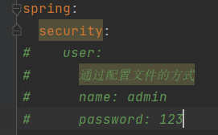
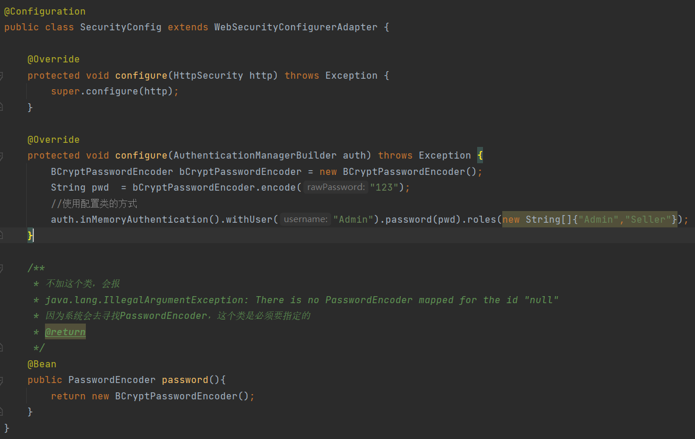

#Spring Security学习

* springSecurity本质是一个过滤器链
  * FilterSecurityInterceptor位于过滤器的最低部
    * dofilter --> invoke -->
      * InterceptorStatusToken token = super.beforeInvocation(filterInvocation);
  * ExceptionSecurityInterceptor
    * dofilter --> invoke --> 处理各种异常
      * handleSpringSecurityException
        * handleAuthenticationException
        * handleAccessDeniedException
  * UsernamePasswordAuthenticationFilter 接收以post方式提交的用户名密码
    * attemptAuthentication 
      * 获取username、password交给AuthenticationManager对应的实现类去实现authentication
      * 代码：this.getAuthenticationManager().authenticate(authRequest);
* 过滤器如何工作
  * 使用springSecurity配置过滤器
    * DelegatingFilterProxy
      * initDelegate
        * Filter delegate = (Filter)wac.getBean(targetBeanName, Filter.class);
        * targetBeanName对应FilterChainProxy
          * FilterChainProxy.doFilterInternal==》 getFilters方法在执行request时加载了SecurityFilterChain
* 重要接口
  * UserDetailService接口
    * loadUserByUsername 通过用户名获取用户对象（包含password串）
  * 重写UsernamePasswordAuthenticationFilter三个方法
    * attemptAuthentication
    * successAuthentication、unsuccessAuthentication在父类中
  * PasswordEncoder 加密接口

#认证实现
三中方式
* 配置文件
  * 
* 配置类
  * 
* 自定义编写实现类